# Optryva — Data Flow Diagram (DFD)

This document presents the data-flow model for the Optryva platform at three
levels of detail:

- **Level 0 — Context Diagram**: the system as a single process with the external
  entities it exchanges data with.
- **Level 1 — System DFD**: the major internal processes, data stores, and flows.
- **Level 2 — AI Match Engine**: a decomposition of the core matching process.

**Notation (Gane–Sarson style, drawn with Mermaid):**

| Shape | Meaning |
|---|---|
| Rectangle `[ ]` | **External entity** (source/sink outside the system) |
| Stadium `([ ])` | **Process** (transforms data) |
| Cylinder `[( )]` | **Data store** |
| Arrow `-->` | **Data flow** (labelled with the data in motion) |

The trust/system boundary is the **single Cloudflare Worker** (client static
assets + `/api/*` + cron). The database is Supabase (Postgres over REST); Claude
and Voyage are external AI services.

---

## Level 0 — Context Diagram

```mermaid
flowchart LR
    student[Student / Job Seeker]
    company[Company / Employer]
    school[School / Career Services]
    claude[Anthropic Claude API]
    voyage[Voyage AI API]
    supabase[(Supabase Postgres)]

    optryva([0&#46; Optryva Platform])

    student -- "register, login, CV, profile edits, applications, messages, AI queries" --> optryva
    optryva -- "match scores, insights, job feed, notifications, coach/research replies" --> student

    company -- "company profile, job postings, application decisions, messages" --> optryva
    optryva -- "applicant lists, candidate matches, notifications" --> company

    school -- "school profile, domain/privacy rules, restricted postings" --> optryva
    optryva -- "students, applicants, gated job feed" --> school

    optryva -- "résumé text, job posting, scoring prompt" --> claude
    claude -- "structured score, parsed résumé, coach/research text" --> optryva

    optryva -- "résumé / job text to embed" --> voyage
    voyage -- "1024-dim vectors" --> optryva

    optryva -- "SQL reads/writes (PostgREST)" --> supabase
    supabase -- "rows: users, profiles, jobs, applications, cache" --> optryva
```



---

## Level 1 — System DFD

Internal processes (numbered 1–6), the data stores they read/write, and the
external entities they exchange data with.

```mermaid
flowchart TB
    %% External entities
    student[Student]
    company[Company]
    school[School]
    claude[Claude API]
    voyage[Voyage API]

    %% Processes
    p1([1&#46; Authentication])
    p2([2&#46; Profile & CV Management])
    p3([3&#46; Job Management])
    p4([4&#46; Application Management])
    p5([5&#46; AI Match & Insights Engine])
    p6([6&#46; Messaging & Social])

    %% Data stores
    d1[(D1 app_users)]
    d2[(D2 profiles)]
    d3[(D3 job_listings)]
    d4[(D4 applications)]
    d5[(D5 ai_match_cache)]
    d6[(D6 ai_calibration)]
    d7[(D7 messages / notifications / follows / ratings)]

    %% --- Authentication ---
    student -- "credentials" --> p1
    company -- "credentials" --> p1
    school -- "credentials" --> p1
    p1 -- "password hash, user row" --> d1
    p1 -- "new profile" --> d2
    p1 -- "access token (JWT) + refresh cookie" --> student

    %% --- Profiles / CV ---
    student -- "profile edits, CV text" --> p2
    company -- "company profile" --> p2
    school -- "profile, student_domains, is_private" --> p2
    p2 -- "upsert profile" --> d2
    p2 -- "invalidate (stale=1) on match-affecting change" --> d5
    p2 -- "résumé text to parse / embed" --> p5

    %% --- Jobs ---
    company -- "create / edit / close posting" --> p3
    school -- "restricted posting" --> p3
    p3 -- "upsert listing" --> d3
    p3 -- "invalidate cached matches (stale=1)" --> d5
    p3 -- "new posting to embed" --> p5
    p3 -- "visibility-gated job feed" --> student
    p3 -- "follower alerts" --> d7

    %% --- Applications ---
    student -- "apply (cover note, documents)" --> p4
    p4 -- "insert application + timeline" --> d4
    p4 -- "reads posting" --> d3
    p4 -- "notify employer" --> d7
    company -- "status decision (shortlist/hire/reject)" --> p4
    p4 -- "status + notify student" --> d4
    p4 -- "outcomes feed calibration" --> d6

    %% --- AI Match Engine ---
    student -- "view matches, insights, compass, AI search" --> p5
    p5 -- "read student + résumé profile" --> d2
    p5 -- "read active, visible jobs" --> d3
    p5 -- "read/write cached scores" --> d5
    p5 -- "read rubric addendum" --> d6
    p5 -- "résumé + job + rubric prompt" --> claude
    claude -- "structured score / parsed résumé / coach text" --> p5
    p5 -- "text to embed" --> voyage
    voyage -- "vectors" --> p5
    p5 -- "embeddings" --> d2
    p5 -- "scores, insights, recommendations" --> student

    %% --- Messaging & Social ---
    student -- "messages, follows, ratings" --> p6
    company -- "messages, replies" --> p6
    p6 -- "threads, reactions, follows, ratings" --> d7
    p6 -- "conversations, notifications" --> student
    p6 -- "conversations, notifications" --> company
```



### Process catalogue

| # | Process | Route(s) | Reads | Writes |
|---|---|---|---|---|
| 1 | Authentication | `/api/auth/*` | D1, D2 | D1, D2 |
| 2 | Profile & CV Management | `/api/profiles/*` | D2 | D2, D5 (invalidate) |
| 3 | Job Management | `/api/jobs/*` | D2, D3 | D3, D5 (invalidate), D7 |
| 4 | Application Management | `/api/applications/*` | D3, D4 | D4, D7 |
| 5 | AI Match & Insights Engine | `/api/ai/*` | D2, D3, D5, D6 | D2 (embeddings), D5 (scores) |
| 6 | Messaging & Social | `/api/social`, `/api/messages`, `/api/notifications` | D2, D7 | D7 |

---

## Level 2 — Process 5: AI Match & Insights Engine

Decomposition of the honest, Claude-scored match engine.

```mermaid
flowchart TB
    student[Student]
    claude[Claude API - Haiku/Opus]
    voyage[Voyage API]

    d2[(D2 profiles)]
    d3[(D3 job_listings)]
    d5[(D5 ai_match_cache)]
    d6[(D6 ai_calibration)]

    p51([5&#46;1 Ensure Résumé Profile])
    p52([5&#46;2 Embed Student & Jobs])
    p53([5&#46;3 Score Match - honest rubric])
    p54([5&#46;4 Apply Confidence & Completeness Caps])
    p55([5&#46;5 Aggregate Insights / Compass / Source])

    student -- "request matches / insights" --> p55

    %% Résumé parse (once, cached on profile)
    p51 -- "read cv_text" --> d2
    p51 -- "parse prompt (cv text)" --> claude
    claude -- "structured resume_profile JSON" --> p51
    p51 -- "store resume_profile" --> d2

    %% Embeddings (optional semantic layer)
    p52 -- "résumé / job text" --> voyage
    voyage -- "1024-dim vector" --> p52
    p52 -- "store embedding" --> d2

    %% Scoring
    p55 -- "for each visible job" --> p53
    p53 -- "cache hit? read score" --> d5
    p53 -- "read active/visible jobs" --> d3
    p53 -- "read rubric addendum" --> d6
    p53 -- "résumé evidence + full job + rubric (cached prefix)" --> claude
    claude -- "score, confidence, breakdown, reasons, flags" --> p53
    p53 -- "raw LlmScore" --> p54
    p54 -- "capped AiMatch (low<=60, no-CV<=50 ...)" --> p55
    p54 -- "upsert score (stale=0)" --> d5

    p55 -- "match scores, gaps, demand, do-next, recommendations" --> student
```



### Notes on the match engine flow

- **Claude is the sole scorer** — there is no deterministic fallback. If Claude is
  unavailable (no `ANTHROPIC_API_KEY` / error), the score flow yields `null` and that
  job is omitted from results.
- **Résumé is parsed once** and cached on the profile (`resume_profile`); it is
  re-parsed only when a match-affecting field changes (profile process 2 sets
  `stale=1` and re-enriches).
- **Honesty caps** (5.4) are deterministic: confidence `low → ≤60`, `medium → ≤88`;
  completeness `no CV → 50`, thin CV `→ 75`, full résumé `→ 99`.
- **Calibration (D6)** is written by the cron/`calibrate` job from real application
  outcomes (process 4) and read back into the scoring prompt — the honesty feedback
  loop.
- The **Voyage embedding** layer (5.2) is optional; without `VOYAGE_API_KEY` it is
  skipped and scoring proceeds on Claude alone.

---

## Data store reference

| Store | Table(s) | Key contents |
|---|---|---|
| D1 | `app_users` | email, password hash, verification flag |
| D2 | `profiles` | identity, role, CV text, `resume_profile` JSON, skills, embedding |
| D3 | `job_listings` | posting fields, tags, visibility gates, embedding |
| D4 | `applications` | status, timeline, documents, cover note |
| D5 | `ai_match_cache` | per `(student, job)` score payload + `stale` flag |
| D6 | `ai_calibration` | singleton `rubric_addendum` (outcome-tuned honesty) |
| D7 | `messages`, `notifications`, `company_follows`, `company_ratings` | social/comms data |
```
